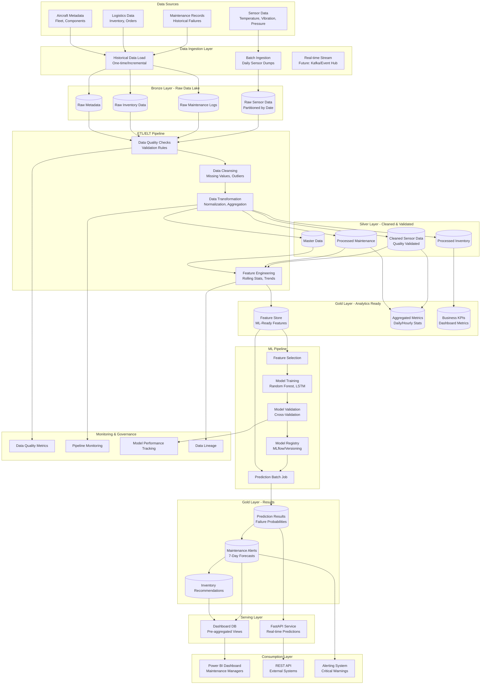
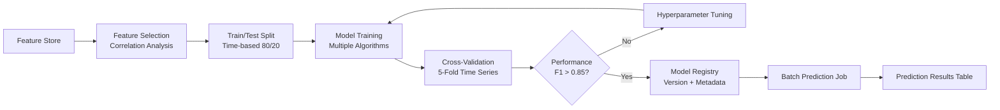
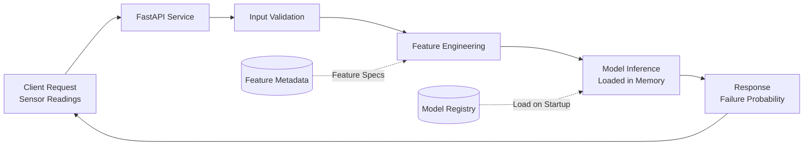

# OLPA Data Architecture Documentation

## Overview
This document describes the end-to-end data architecture for the Optimisation Logistique & Prédictive Aéronautique (OLPA) project, designed for aeronautical predictive maintenance and inventory optimization.

## Architecture Principles

### Core Design Decisions
1. **Cloud-Agnostic Design**: Compatible with both Azure and AWS services
2. **Medallion Architecture**: Bronze (Raw) → Silver (Processed) → Gold (Analytics-ready) layers
3. **Batch + Real-time**: Daily batch processing with real-time API query capabilities
4. **Scalability First**: Designed to handle growing sensor data volumes and additional aircraft
5. **Data Quality Focus**: Built-in validation and monitoring at each pipeline stage
6. **MLOps Ready**: Integrated ML model versioning and monitoring capabilities

### Key Technology Choices
- **Data Storage**: Object storage (S3/ADLS Gen2) + Relational DB (PostgreSQL/Azure SQL)
- **Data Processing**: Python-based ETL with Pandas/Polars for MVP, Spark-ready for scale
- **Orchestration**: Airflow-ready design (config-driven for initial batch jobs)
- **ML Pipeline**: Integrated feature store and model registry pattern
- **API Layer**: FastAPI for low-latency prediction serving

## System Architecture Diagram



## Detailed Layer Specifications

### 1. Data Ingestion Layer

#### Batch Ingestion Process
- **Frequency**: Daily at 2:00 AM UTC
- **Format**: CSV/Parquet files from sensor systems
- **Volume**: ~10-50 GB per day (scales with fleet size)
- **Validation**: Schema validation, file integrity checks
- **Error Handling**: Failed files moved to error queue for manual review

#### Data Sources Details
| Source | Format | Frequency | Volume | Criticality |
|--------|--------|-----------|---------|-------------|
| Sensor Data | CSV/Parquet | Daily | 1M-10M records/day | High |
| Maintenance Logs | CSV/JSON | Daily | 100-1K records/day | High |
| Inventory Data | CSV | Daily | 10K-50K records/day | Medium |
| Aircraft Metadata | JSON | Weekly | 1K records | Low |

### 2. Bronze Layer - Raw Data Lake

#### Storage Strategy
- **Technology**: Object Storage (S3/ADLS Gen2)
- **Format**: Parquet (compressed with Snappy)
- **Partitioning**:
  - Sensor Data: `/bronze/sensor_data/year=YYYY/month=MM/day=DD/`
  - Maintenance: `/bronze/maintenance/year=YYYY/month=MM/`
  - Inventory: `/bronze/inventory/year=YYYY/month=MM/day=DD/`
- **Retention**: 2 years rolling window
- **Access Pattern**: Write-once, read-many for ETL jobs

### 3. Silver Layer - Cleaned & Validated

#### Data Quality Rules
- **Completeness**: No more than 5% missing values per column
- **Validity**: Sensor readings within physically possible ranges
- **Consistency**: Timestamps in correct order, no duplicates
- **Accuracy**: Cross-validation with maintenance records

#### Transformations Applied
1. **Missing Value Imputation**:
   - Forward fill for short gaps (<1 hour)
   - Median imputation for longer gaps
   - Flag imputed values for transparency

2. **Outlier Detection**:
   - IQR method for statistical outliers
   - Domain-based rules (e.g., temperature < 200°C)
   - Outliers flagged, not removed

3. **Data Normalization**:
   - Timestamp standardization to UTC
   - Sensor ID standardization
   - Unit conversions (all to SI units)

### 4. Gold Layer - Analytics Ready

#### Feature Store Schema
Features organized into feature groups:

1. **Time-Series Features** (1-hour windows):
   - Rolling mean (3h, 6h, 12h, 24h)
   - Rolling std deviation
   - Rate of change
   - Min/max values

2. **Statistical Features**:
   - Trend indicators (increasing/decreasing)
   - Seasonality patterns
   - Autocorrelation metrics

3. **Domain Features**:
   - Time since last maintenance
   - Cumulative operating hours
   - Failure history indicators
   - Component age

4. **Derived Features**:
   - Multi-sensor interactions
   - Anomaly scores
   - Health indices

#### Aggregated Metrics Tables
- **Daily Sensor Summary**: Min, max, avg, std for each sensor per aircraft
- **Maintenance KPIs**: MTBF, MTTR, failure rates
- **Inventory KPIs**: Stock levels, turnover rates, stock-out incidents

### 5. ML Pipeline Architecture



#### ML Model Specifications
- **Target Variable**: Binary failure within 7 days (0/1)
- **Algorithms Evaluated**:
  - Random Forest (baseline)
  - Gradient Boosting (XGBoost)
  - LSTM (time-series deep learning)
- **Performance Metrics**:
  - Primary: F1-Score, Recall (minimize false negatives)
  - Secondary: Precision, ROC-AUC
  - Business: Cost of false positives vs false negatives

#### Model Versioning Strategy
- **Storage**: MLflow model registry or equivalent
- **Metadata Tracked**:
  - Training date, data version
  - Hyperparameters
  - Performance metrics
  - Feature importance
  - Training/validation dataset hashes
- **Deployment**: Blue-green deployment pattern

### 6. Serving Layer Architecture

#### Real-time Prediction API


**API Characteristics**:
- **Latency Target**: <100ms p99
- **Throughput**: 1000 requests/sec (horizontal scaling)
- **Model Loading**: Model cached in memory, hot-reload on version update
- **Input Format**: JSON with sensor readings (last 24 hours)
- **Output Format**: JSON with failure probability and confidence intervals

#### Dashboard Database
- **Technology**: PostgreSQL with materialized views
- **Refresh**: Every 1 hour (scheduled refresh)
- **Optimization**: Pre-aggregated views for common dashboard queries
- **Indexes**: Optimized for time-range and aircraft ID filters

### 7. Monitoring & Governance

#### Data Quality Monitoring
- **Metrics Tracked**:
  - Data freshness (time since last update)
  - Completeness percentage
  - Schema drift detection
  - Value distribution changes
- **Alerting**: Slack/Email notifications on threshold breaches

#### Pipeline Monitoring
- **Metrics**:
  - Job success/failure rates
  - Processing time per stage
  - Data volume processed
  - Resource utilization
- **Logging**: Structured logs (JSON) with correlation IDs

#### Model Performance Monitoring
- **Online Metrics**:
  - Prediction distribution drift
  - Input data drift (feature distributions)
  - API latency and error rates
- **Offline Metrics**:
  - Weekly ground truth comparison (actual failures vs predictions)
  - Precision/Recall trends over time
  - Model retraining triggers

#### Data Lineage
- **Tracking**:
  - Source to gold layer transformations
  - Feature derivation logic
  - Model training data provenance
- **Tools**: Custom metadata tables + visualization (future: DataHub/Amundsen)

## Cloud Deployment Options

### AWS Architecture
```
Data Lake: S3 (Bronze/Silver/Gold buckets)
Database: RDS PostgreSQL / Aurora
Processing: Lambda (lightweight) / EMR (Spark for scale)
Orchestration: Step Functions / Managed Airflow (MWAA)
ML: SageMaker (optional) / Custom EC2 with MLflow
API: ECS Fargate / Lambda
Monitoring: CloudWatch + Custom Dashboard
```

### Azure Architecture
```
Data Lake: ADLS Gen2 (containers for Bronze/Silver/Gold)
Database: Azure SQL Database / PostgreSQL
Processing: Azure Functions / Databricks (Spark)
Orchestration: Azure Data Factory / Logic Apps
ML: Azure ML (optional) / Custom VM with MLflow
API: Azure Container Instances / App Service
Monitoring: Azure Monitor + Application Insights
```

## Scalability Considerations

### Current (MVP) Scale
- Aircraft Fleet: 10-50 aircraft
- Sensors per Aircraft: 20-50 sensors
- Data Points: ~1M sensor readings/day
- Processing: Single-node Python (Pandas/Polars)
- Storage: ~500 GB total

### Future Scale (Production)
- Aircraft Fleet: 500+ aircraft
- Sensors per Aircraft: 100+ sensors
- Data Points: ~100M sensor readings/day
- Processing: Spark cluster (auto-scaling)
- Storage: 10+ TB total
- Real-time Stream: Kafka/Event Hub integration

### Migration Path
1. **Phase 1 (MVP)**: Single server PostgreSQL + local Parquet files
2. **Phase 2**: Cloud object storage + managed database
3. **Phase 3**: Spark processing for historical data
4. **Phase 4**: Real-time streaming integration
5. **Phase 5**: Multi-region deployment

## Security & Compliance

### Data Security
- **Encryption at Rest**: AES-256 for all storage layers
- **Encryption in Transit**: TLS 1.2+ for all data movement
- **Access Control**: Role-based access (RBAC) with principle of least privilege
- **Secrets Management**: Cloud-native secret stores (AWS Secrets Manager / Azure Key Vault)
- **Audit Logging**: All data access logged with user/service identity

### Compliance Considerations
- **Data Retention**: Configurable retention policies per data type
- **Data Privacy**: PII handling guidelines (if applicable to maintenance data)
- **Regulatory**: Aviation industry compliance (e.g., EASA/FAA data retention)

## Cost Optimization

### Storage Tiering
- **Hot**: Last 30 days in premium storage (frequent access)
- **Warm**: 31-180 days in standard storage (weekly access)
- **Cold**: 180+ days in archive storage (rare access)

### Compute Optimization
- **Batch Jobs**: Spot/preemptible instances (50-70% cost savings)
- **API**: Auto-scaling based on load (scale to zero in non-production)
- **Database**: Right-sizing based on workload patterns

### Monitoring
- **Cost Tracking**: Tag all resources by environment and component
- **Budget Alerts**: Set spending thresholds with notifications
- **Optimization Reports**: Monthly review of underutilized resources

## Disaster Recovery

### Backup Strategy
- **Database**: Daily automated backups (7-day retention)
- **Data Lake**: Cross-region replication for Bronze layer
- **Models**: Version-controlled in model registry with backup

### Recovery Objectives
- **RTO (Recovery Time Objective)**: 4 hours for full system restore
- **RPO (Recovery Point Objective)**: <24 hours of data loss maximum

## Performance Benchmarks

### ETL Processing
- **Bronze to Silver**: 30-60 minutes for daily batch
- **Silver to Gold**: 15-30 minutes for feature engineering
- **ML Training**: 2-4 hours for full model retraining

### API Performance
- **Latency**: <50ms p50, <100ms p99
- **Throughput**: 500+ req/sec on 2 vCPU instance
- **Availability**: 99.9% uptime target

## Next Steps for Implementation

1. **Sprint 1.2 Completed Items**:
   - Architecture documentation
   - Database schema design
   - Pipeline configuration template
   - Database utility module

2. **Sprint 1.3 Priorities**:
   - Set up cloud environment (dev/prod)
   - Implement data ingestion scripts
   - Load initial dataset
   - Test ETL pipeline end-to-end

3. **Future Enhancements**:
   - Stream processing integration
   - Advanced feature engineering automation
   - AutoML for model selection
   - Self-service analytics capabilities

## References

- **Data Engineering Best Practices**: Medallion Architecture (Databricks)
- **ML Pipeline Patterns**: Hidden Technical Debt in ML Systems (Google)
- **Time-Series Forecasting**: Deep Learning for Time Series (AWS)
- **Aeronautical Standards**: EASA Part-M Maintenance Standards

---

**Document Version**: 1.0
**Last Updated**: 05/02/2026
**Owner**: Data Engineering Team
**Review Cycle**: Quarterly
